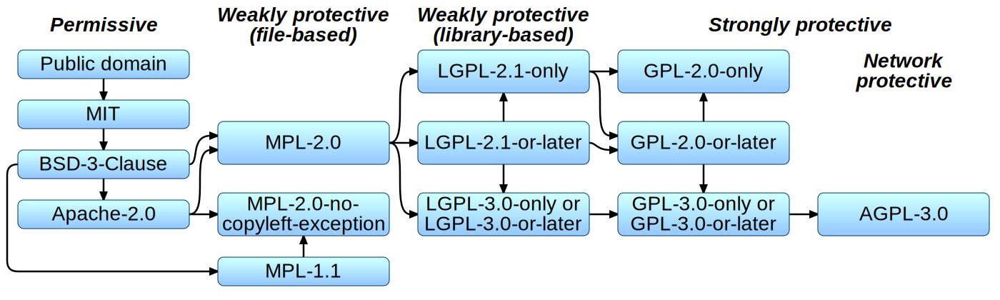
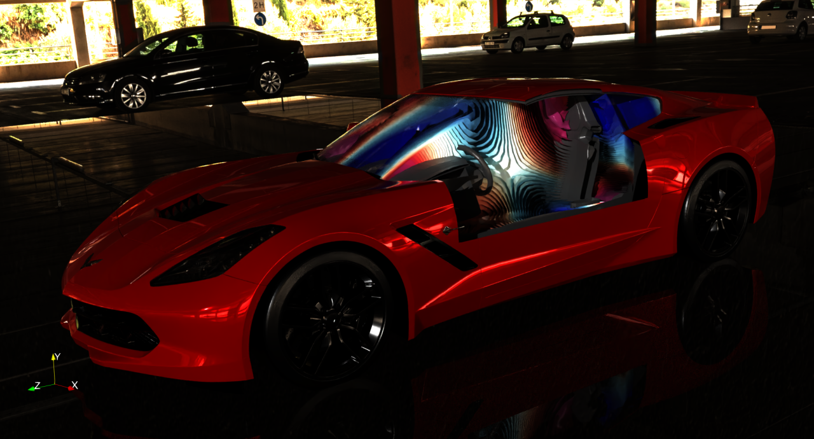
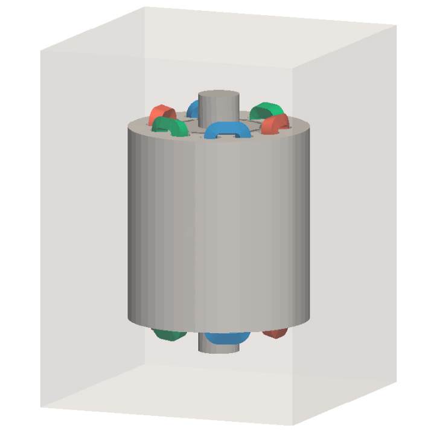
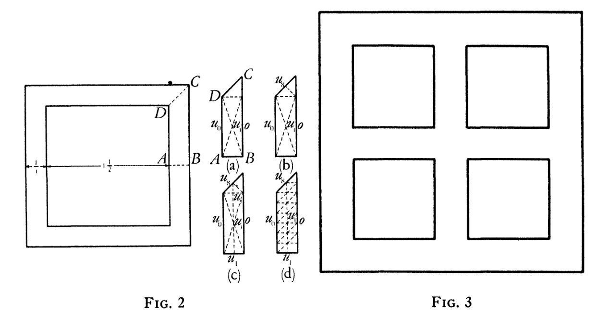
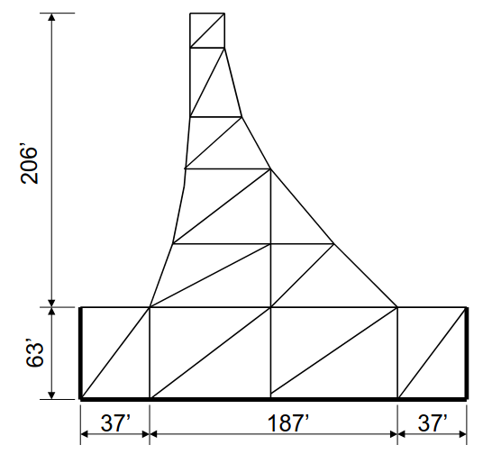
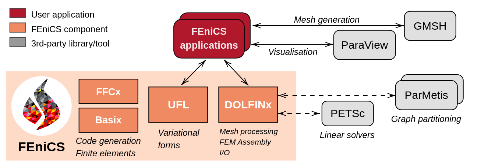

# Open-source simulation tools – opportunities and limitations

<center>
IDA Webinar 29/01/2026<br>
<b>Jørgen S. Dokken</b> (Simula Research Laboratory)
<br/>
<b>Jack S. Hale</b> (University of Luxembourg)
<div>

</div>

</center>

---

# About us

---

# Jørgen S. Dokken

<div data-marpit-fragment>

- **2016-2019:** PhD in informatics from University of Oslo/Simula Research Laboratory (SRL)

</div>

<div data-marpit-fragment>

- **2019-2022**: Postdoctoral researcher at University of Cambridge
- **2022-2023**: Research Engineer at Simula
- **2024-today**: Senior Research Engineer at Simula

</div>
<div data-marpit-fragment>
<hr/>

- **2014**: First introduction to FEniCS Project
- **2022-**: Leading management and design of FEniCS Project

</div>


---

# Jack S. Hale

<div data-marpit-fragment>

- **2009-2013:** PhD in Aeronautical Engineering, Imperial College

</div>

<div data-marpit-fragment>

- **2013-2021**: Postdoctoral Researcher at University of Luxembourg
- **2021-today**: Senior Research Scientist, University of Luxembourg

</div>
<div data-marpit-fragment>
<hr/>

- **Ongoing**: Research in numerical computing with applications in mechanics.
- **2009**: First introduction to FEniCS Project
- **2017-today**: Leading management and design of FEniCS Project

</div>


---

# Outline

- Why this talk?
- What are "open-source simulation tools"?
  - Simulation tools.
  - Open-source.
- What do open-source simulations enable?
- What are the constraints and limitations?
- A (brief) history of finite element methods.
- A demo of the FEniCS Project.
- Conclusions:www.

---

# Why now?

- <b>Simulation</b> has become a key enabling tool in Engineering and Science.
- Demands from industry and academia are forcing change:
  - Diversity, complexity, uncertainty.
  - Reproducibility, transparency, auditability.
  - Novel computing hardware - "AI".
  - Budget constraints.
- Proprietary, open-source and "hybrid" simulation software will respond.

---

# Engineering Simulation Workflow

- Geometry/CAD → Mesh → Simulation → Postprocessing → Reporting.

<figure style="text-align: center;">
  
  <figcaption style="font-size: 50%; padding-top: 10px;">
    Salome FEA, LGPLv2+<sup>1</sup>
  </figcaption>
</figure>

<!-- footer: <sup>1</sup>By Joël Cugnoni - http://www.caelinux.com, GPL, https://commons.wikimedia.org/w/index.php?curid=3893245 -->

---

<!-- footer: <br><br> -->

# Engineering Simulation Workflow (cont.)

- Geometry/CAD → Mesh → Simulation → Postprocessing → Reporting.
- Proprietary integrated (Dassault Simulia) e.g.:
  - Catia V5 → Abaqus pre-processing → Abaqus/Standard → Abaqus postprocessing → Custom.
- Open-source interoperable e.g.:
  - FreeCAD/OpenCascade → Gmsh → <b style="color:#f15922">FEniCS</b> → Paraview → Custom.
- Open-source integrated e.g.:
  - Salome FEA, agros, FreeCAD, Elmer.

---

# What is open-source?

<div data-marpit-fragment>
<div>

### <s>One can look at the source code</s>

</div>
</div>

---

# The Process

1. Someone creates some code. They hold copyright.
2. They would like to freely share their work, but they would like others to credit them and/or share too.
3. An open-source license is the right solution.

---

# Definition of open-source$^{2}$

<!--  footer: <sup>2</sup>https://opensource.org/definition-annotated - 10 terms in definition. -->

<div data-marpit-fragment>
<div>

- **Free Redistribution**: Anyone should be able to redistribute the code under the same license terms, without having to pay a royalty or fee to the creator.

</div>
</div>
<div data-marpit-fragment>
<div>

- **Source code availability**: Compiled program must include source code and allow for redistribution of source code.
- **Derived works**: Must allow for modifications or derived works that can be published under the same license.

</div>
</div>
<div data-marpit-fragment>

- **No discrimination** against persons, groups or fields of endeavour.

</div>
</div>
</div>

---

<!--  footer: <br/><br/> -->

# Open-source license models (simplified)

- **Permissive:** Do what you want, just make sure I get credit (US Universities, Apple open-source, Microsoft open-source).
- **Weakly protective**: If you make changes to my code, the new work must also be weakly protected. Your code remains yours (FEniCS, FFmpeg, GMP).
- **Strongly protective**: If you link to, copy or modify my code, our combined work must also be strongly protected (Linux, MySQL).

---

<!--  footer: <sup>3</sup>By David A. Wheeler, et al. - The Free-Libre / Open Source Software (FLOSS) License Slide by Dwheeler (2007-09-27)About MPL 2.0: Revision Process and Changes FAQ — Mozilla, CC BY-SA 3.0, https://commons.wikimedia.org/w/index.php?curid=93181991
 -->

# Commonly used licenses

<figure style="text-align: center;">
  
  <figcaption style="font-size: 50%; padding-top: 10px;">
    Figure by  David A. Wheeler et al.<sup>3</sup>
  </figcaption>
</figure>

---

# Classic examples of open-source software

<!--  footer:  <sup>4</sup> lewing@isc.tamu.edu Larry Ewing and The GIMP, Attribution, https://commons.wikimedia.org/w/index.php?curid=80930 <br> <sup>5</sup> Licensed under the <a href="https://creativecommons.org/licenses/by/3.0/">Creative Commons Attribution 3.0 Unported License</a> <br><sup>6</sup> Unaltered logo from <a href="https://www.python.org/community/logos/">https://www.python.org/community/logos/</a> -->

<div style="display: flex; gap: 20px; align-items: flex-end;">
  
  <figure data-marpit-fragment style="margin: 0; display: flex; flex-direction: column; align-items: center; width: 333px;">
    GPLv2
    
    <figcaption style="font-size: 50%; padding-top: 10px; text-align: center;">
      logo by Larry Ewing<sup>4</sup>
    </figcaption>
  </figure>

  <figure data-marpit-fragment style="margin: 0; display: flex; flex-direction: column; align-items: center; width: 333px;">
    GPLv2
    
    <figcaption style="font-size: 50%; padding-top: 10px; text-align: center;">
      logo by Jason Long<sup>5</sup>
    </figcaption>
  </figure>

  <figure data-marpit-fragment style="margin: 0; display: flex; flex-direction: column; align-items: center; width: 500px;">
    PSFL (GPL-compatible*)
    
    <figcaption style="font-size: 50%; padding-top: 10px; text-align: center;">
      logo from <sup>6</sup>
    </figcaption>
  </figure>
</div>

---

<!--  footer:  <br><br> -->

# Some common misconceptions

- "Free" means I can't sell software or make money: <b style="color: red">false</b>.
  - **RedHat**: Sells compiled Linux distribution and support contracts.
  - **Gmsh** (mesher, GPL): Sells proprietary license to allow integration into commercial code.
  - **MySQL**: Feature complete open-source product + enterprise add-ons.

---

# Some common misconceptions (cont.)

- "Free" I won't need to pay any money for simulation support: <b style="color: red">false</b>.
  - Unless you are an expert in simulation software, or have a large in-house
    team, you may well still need a support contract or integration work.

---

# Some common misconceptions (cont.)

- If I use/modify open-source code internally at my company, I must give back my changes: <b style="color: red">false</b>.
  - "Distribution" means between legal persons.

---

# Some common misconceptions (cont.)

- If I distribute my code and it uses open-source code, then all of my code must be open-source too.
  - <i><b style="color: red">False</b></i> for permissive code - just give credit.
  - <i><b style="color: red">False</b></i> for weakly protected code - open-source obligations restricted to open-source code.
  - <i><b style="color: red">False</b></i> for most normal uses of strongly protected code, e.g. using <b>Linux</b>, using <b>MySQL</b>, using <b>Firefox</b>.

---

# Opportunities

---

# Faster, unconstrained innovation

- Community-driven features.
- Rapid prototyping of new full solvers.
- Research-to-production path: new discretisations, preconditioners, automatic differentiation.

---

# Firon ApS

<figure style="text-align: center;">
  
  <figcaption style="font-size: 50%; padding-top: 10px;">
    Firon ApS is a Danish startup that uses FEniCS to predict CNC milling vibrations (see: <a href=https://firon.dk>https://firon.dk</a>)
  </figcaption>
</figure>

---

# Proxima Fusion

<figure style="text-align: center;">
  
  <figcaption style="font-size: 50%; padding-top: 10px;">
    Proxima Fusion uses FEniCS to simulate heat transfer in the walls of a stellarators <br>(see: <a href=https://www.proximafusion.com>https://www.proximafusion.com</a>)<br>
    Image courtesy of Proxima Fusion
  </figcaption>
</figure>

---

# Composability and interoperability

- "Unix philosophy" - do one thing and do it well.
- Open data.
- Open programming interfaces (APIs).

---

# Reproducibility and transparency

- Inspect algorithms, verify assumptions, audit numerics.
- Build reproducible pipelines.

---

# Undabit

<div class=skewed-columns>
<div>
<figure style="text-align: center;">
  
  <figcaption style="font-size: 50%; padding-top: 10px;">
    Undabit uses FEniCS for acoustic simulation <br>(see: <a href=https://undabit.com>https://undabit.com</a>)<br>
    Image courtesy of Antonio Svizzero
  </figcaption>
</figure>
</div>
<div  style="font-size: 20px">
<br><br><br>
<em  style="font-size: 20px">
"As a former user of commercial software I often felt limited by their 'black box' architecture. FEniCS gives Undabit direct access to manipulate the governing equations and system matrices. This flexibility allows us to build custom tools and solve rigorous engineering challenges for real-world industrial applications that commercial software simply cannot match."
</em>
Antonio Svizzero (Founder of UndaBit)

</div>
</div>

---

# Reproducibility and transparency

- Inspect algorithms, verify assumptions, audit numerics.
- Build reproducible pipelines.

---


---

# Cost and access

- Low barrier for entry, academia, SMEs and global collaboration.
- Parametric job and HPC-friendly licensing.
- Avoid vendor lock-in.

---

<div>
<figure style="text-align: center;">
  
  <figcaption style="font-size: 50%; padding-top: 10px;">
  Global issues: Global weather models, NSF/NCAR Weather Research and Forecasting Model. 
  </figcaption>
</figure>
</div>

---

# Solver performance

<div class=right-skewed-columns>
<div>
<br>

- Performance of open-source simulation software is <b>world class</b>.
- Scalability, performance and energy-use.

</div>

<div>
<figure style="text-align: center;">
  
  <figcaption style="font-size: 50%; padding-top: 10px;">
  Figure from the PhD thesis of J.P. Dean<sup>19</sup>
  </figcaption>
</figure>

</div>
</div>

<!-- footer: <sup>19</sup> Dean, J.P, _Mathematical and computational aspects of solving mixed-domain problems using the finite element method_, PhD Thesis, DOI: <a href=https://doi.org/10.17863/CAM.108292>10.17863/CAM.108292</a><br>  -->

---

# Permanent magnet synchronous motor

<!--  footer:  <sup>7</sup> McDonagh, J., et al. (2022). Modelling a permanent magnet synchronous motor in FEniCSx for parallel high-performance simulations. Finite Elements in Analysis and Design, DOI: <a href=https://doi.org/10.1016/j.finel.2022.103755>10.1016/j.finel.2022.103755</a> . -->

<div class=columns>
<div>
<figure style="text-align: center;">
  
  <figcaption style="font-size: 50%;">
    Permanent magnet synchronous motor geometry used to Maxwell's equations<sup>7</sup>
  </figcaption>
</figure>
</div>
<div>

<i style="font-size: 25px"><br>"The FEniCSx model showed a 57% greater speedup than the Ansys Maxwell model
solved using the distributed solve option and a 16.5 times larger speedup than
the time decomposition method, at identical core counts".</i><sup style="font-size: 20px">7</sup>

</div>
</columns>

---

# Limitations

<!-- footer: <br><br> -->

- Verification/validation burden moves downstream.
- Knowledge concentration into a few maintainers (bus factor).
- Fragmentation across ecosystem.
- License compatibility (GPL).
- Support and liability.

---

# Checklist

- Does the software support the features I need?
- Is the software verified? Unit tests, examples, published studies.
- How big/active is the development team?
- Is the project in good health? Commits, releases.
- Does the code interoperate with existing workflows?
  - Hybrid open-source/proprietary.
- Does the open-source licensing fit my intended use?
- Is there paid support? Consultancy.

---

# Finite elements and FEniCS 

---

# Brief history of the finite element method<sup>8</sup>

<!--  -->

**1910s: Rayleigh-Ritz/Ritz-Galerkin method**
Find $u\in V_0$ such that

$$
R(x) = - \nabla \cdot (\nabla u) - f = 0  \text{ in } \Omega \\
$$

Define $u_h = \sum_{i=1}^{N} u_i \phi_i(x)$ and an inner product
$\langle \cdot , \cdot \rangle: V_0 \times V_0 \rightarrow \mathbb{R}$ such that

$$
\langle R(x), \phi_i \rangle = 0 \qquad\forall i=1,\cdots,N
$$

<!--  footer:  <sup>8</sup>Liu, W.K., Li, S. & Park, H.S. Eighty Years of the Finite Element Method: Birth, Evolution, and Future. Arch Computat Methods Eng 29, 4431–4453 (2022). DOI: <a href=https://doi.org/10.1007/s11831-022-09740-9>10.1007/s11831-022-09740-9</a> -->

---

# Brief history of the finite element method

**1940s**: Sparse support Ritz-Galerkin <sup>9</sup> for plates.

<figure style="text-align: center;">
  
  <figcaption style="font-size: 50%; padding-top: 10px;">
    Figure of the computational grid used in Courant<sup>9</sup> compared with classical Ritz-Galerkin.
  </figcaption>
</figure>
<br>

<!--  footer:  <sup>9</sup>Courant, R. (1943). Variational methods for the solution of problems of equilibrium and vibrations. Bulletin of the American Mathematical Society, 49(1), 1-23. -->

---

# Brief history of the finite element method

**1950s**: The birth of FEM <sup>10</sup> at Boeing

**1963**: Symbolic Matrix Interpretive System (FORTRAN, freeware)

<figure style="text-align: center;">
  
  <figcaption style="font-size: 50%; padding-top: 10px;">
    First finite element mesh used for the analysis of gravity dam<sup>11</sup>
  </figcaption>
</figure>
<br>
<br>

<!--  footer: <sup>10</sup>Clough, R. W. (1990). Original formulation of the finite element method. Finite elements in analysis and design, 7(2), 89-101. <br><sup>11</sup>Clough, R. W., & Wilson, E. L. (1999, August). Early finite element research at Berkeley. In Fifth US national conference on computational mechanics (pp. 1-35).-->

---

# Brief history of the finite element software

<!--  -->

<!-- <div data-marpit-fragment="1"> -->

- **1970s**: General purpose FE software and mathematical rigorousness

<!-- </div> -->
<div data-marpit-fragment="2">

- **1990s**: Object oriented programming (C++: DiffPack, FreeFEM+)

</div>
<div data-marpit-fragment="3">

- **2000s**: User-friendliness, automatic code generation (FEniCS, Firedrake)

</div>

<div data-marpit-fragment="4">

- **2010s**: High performance computing and hybrid architectures (MFEM, and above)

</div>
<div data-marpit-fragment="5">

- **2025**: Market value 6.91 billion USD <sup>12</sup>
- **2036**: Forecast market value 25.39 billion USD <sup>12</sup>

</div>

<!--  footer: <sup>12</sup> Research Nester. Finite Element Analysis (FEA) Software Market Outlook. 2026. url: https://www.researchnester.com/reports/finite-element-analysis-software-market/4188. -->

---

<!--  footer: <br><br> -->

# Finite element frameworks

<columns class="columns">

<div data-marpit-fragment>

### Open-source

- FEniCS (2003--), LGPL 3.0
- Elmer (2005--), GPL 2.0
- FreeFem (1992--), LGPL 3.0
- Code_Aster (2001--), GPL 3.0
- deal.ii (2000--), LGPL 2.1 or later
- MOOSE (2008--), LGPL 2.1
- MFEM (2010--), BSD 3-Clause License
- ...
</div>

<div data-marpit-fragment>

### Proprietary

- MSC Nastran (1971--)
- ANSYS (1970--)
- LS-DYNA (1976--2019)
- ABAQUS (1978--)
- COMSOL (1986--)
- FEATool multiphysics [FEniCS backend] (2013--)
- ...

</div>
</div>

---

# How does FEniCS fit into this landscape?

- Geometry/CAD → Mesh → **Simulation** → Postprocessing → Reporting.
- Open source (multiple providers) e.g.:
  - FreeCAD/OpenCascade → Gmsh → **FEniCS** → Paraview → Custom.

---

# Brief history of FEniCS


<div data-marpit-fragment>

- **2002**: First public version of C++ library.
- **2003**: FEniCS Project was created.
- **2005**: First Python interface to C++ library - easier to use.
- **2008**: Symbolic language + code generation 'mature'.

</div>
<div data-marpit-fragment>

- **2009**: Initial MPI support.
- **2017**: Bottom up re-write: pre-exascale HPC.

</div>

---

# Brief history of FEniCS


<div data-marpit-fragment>

- **Today**:
  - Used worldwide across academia, SMEs, multinationals.
  - ~12 000 monthly downloads.
  - ~3800 monthly users of help forum.
  - ~1300 citations per year of main papers.

---

<!-- footer: <br> -->


# FEniCS Steering Council

Formalised governance.
<font size="6">

Francesco Ballarin (Università Cattolica del Sacro Cuore)
Cécile Daversin-Catty (Simula Research Laboratory)
<b>Jørgen S. Dokken (Simula Research Laboratory)</b>
Michal Habera (University of Luxembourg)
<b>Jack S. Hale (University of Luxembourg)</b>
Chris Richardson (University of Cambridge)
Matthew W. Scroggs (University College London)
Nathan Sime (Carnegie Institution for Science)
Garth N. Wells (University of Cambridge)

</font>

<br>
<center>

<center/>

---

# FEniCS 2017-

<center>

<br>DOI: <a href="https://doi.org/10.5281/zenodo.10447665">10.5281/zenodo.10447665</a>
<br>
</center>

<!--  footer: Baratta, Dean, Dokken, Habera, Hale, Richardson, Rognes, Scroggs, Sime, Wells. 2023. DOLFINx: _The next generation FEniCS problem solving environment_. Zenodo. DOI: 10.5281/zenodo.10447666 <br><br> -->

</div>

---

# Key features

- Write mathematics as code.
- Automatic construction of finite element models.
- HPC ready.

<!-- footer: <br> -->

---

# Live demo (summary)

- Pre-processing (STEP to mesh, via gmsh).
- Writing a complete elasticity solver in Python (FEniCS).
- Postprocessing (FEniCS).
- Output (FEniCS to open format VTK).
- Visualisation (Paraview).

---

# How does it work?<sup>13</sup>

<div>
<figure style="text-align: center;">
  
</figure>
</div>

<!--  footer: <sup>13</sup> Diagram provided by James Trotter (Simula Research Laboratory) -->

---

# Code generation

```c

void tabulate_tensor_integral_a80de02e2fc39315d8672b75da91b1586209cb47(double* restrict A,
                                    const double* restrict w,
                                    const double* restrict c,
                                    const double* restrict coordinate_dofs,
                                    const int* restrict entity_local_index,
                                    const uint8_t* restrict quadrature_permutation)
{
// Quadrature rules
static const double weights_39d[6] = {0.054975871827661, 0.054975871827661, 0.054975871827661, 0.1116907948390055, 0.1116907948390055, 0.1116907948390055};
// Precomputed values of basis functions and precomputations
// FE* dimensions: [permutation][entities][points][dofs]
static const double FE1_C0_D10_Q39d[1][1][1][3] = {{{{-1.0, 1.0, 0.0}}}};
static const double FE1_C1_D01_Q39d[1][1][1][3] = {{{{-1.0, 0.0, 1.0}}}};
static const double FE2_C0_Q39d[1][1][6][6] = {{{{-0.07480380774819603, 0.5176323419876736, -0.07480380774819671, 0.2992152309927871, 0.03354481152314834, 0.2992152309927839},
  {-0.07480380774819613, -0.0748038077481966, 0.5176323419876735, 0.2992152309927871, 0.2992152309927838, 0.03354481152314828},
  {0.5176323419876713, -0.0748038077481967, -0.07480380774819674, 0.03354481152314866, 0.2992152309927869, 0.2992152309927868},
  {-0.04820837781551195, -0.08473049309397784, -0.04820837781551192, 0.1928335112620479, 0.7954802262009061, 0.1928335112620478},
  {-0.04820837781551193, -0.048208377815512, -0.08473049309397786, 0.1928335112620479, 0.192833511262048, 0.7954802262009062},
  {-0.08473049309397794, -0.04820837781551188, -0.04820837781551195, 0.7954802262009061, 0.1928335112620479, 0.1928335112620479}}}};
// ------------------------
}
```

<!--  footer: <br><br> -->

---

# Generated code continued (Jacobian)

```c
// ------------------------
// Section: Jacobian
// Inputs: coordinate_dofs, FE1_C1_D01_Q39d, FE1_C0_D10_Q39d
// Outputs: J_c3, J_c1, J_c2, J_c0
double J_c0 = 0.0;
double J_c3 = 0.0;
double J_c1 = 0.0;
double J_c2 = 0.0;
{
  for (int ic = 0; ic < 3; ++ic)
  {
    J_c0 += coordinate_dofs[(ic) * 3] * FE1_C0_D10_Q39d[0][0][0][ic];
    J_c3 += coordinate_dofs[(ic) * 3 + 1] * FE1_C1_D01_Q39d[0][0][0][ic];
    J_c1 += coordinate_dofs[(ic) * 3] * FE1_C1_D01_Q39d[0][0][0][ic];
    J_c2 += coordinate_dofs[(ic) * 3 + 1] * FE1_C0_D10_Q39d[0][0][0][ic];
  }
}
// ------------------------
double sp_39d_0 = J_c0 * J_c3;
double sp_39d_1 = J_c1 * J_c2;
double sp_39d_2 = -sp_39d_1;
double sp_39d_3 = sp_39d_0 + sp_39d_2;
double sp_39d_4 = fabs(sp_39d_3);
```

---

# Generated code continued (local tensor)

```c
for (int iq = 0; iq < 6; ++iq)
{
  // Section: Intermediates
  double fw0 = 0;
  {
    fw0 = sp_39d_4 * weights_39d[iq];
  }
  // Section: Tensor Computation
  // Inputs: FE2_C0_Q39d, fw0
  // Outputs: A
  {
    double temp_0[6] = {0};
    for (int j = 0; j < 6; ++j)
    {
      temp_0[j] = fw0 * FE2_C0_Q39d[0][0][iq][j];
    }
    for (int j = 0; j < 6; ++j)
    {
      for (int i = 0; i < 6; ++i)
      {
        A[6 * (i) + (j)] += FE2_C0_Q39d[0][0][iq][i] * temp_0[j];
      }
    }
  }
}
```

---

# Conclusions

- The overall market for simulation is still growing.
- Increasing demands: complexity, transparency, hardware, budgets.
- Open-source simulation software has improved enormously:
   - Ease-of-use.
   - Integration.
- And is world-leading in terms of performance and flexibility.
- Provides unique opportunities (and some drawbacks).
- Proprietary/open-source and fully open-source simulation workflows

---
<center>
<div style="font-size:30px">
<br>
If you want to get in touch<br>
<a href="mailto:dokken@simula.no">dokken@simula.no</a><br>
<a href="mailto:jack.hale@uni.lu">jack.hale@uni.lu</a><br>
<a href="https://fenicsproject.discourse.group/">https://fenicsproject.discourse.group/</a><br>
</div>
<center/>

---

# Backup slides

---

# How does it work?

### Package overview


<!-- footer: <br> -->

# UFL + Basix = Variational forms

```python
import ufl
from basix.ufl import element

cell = "triangle"
c_el = element("Lagrange", cell, 1, shape=(2,))
domain = ufl.Mesh(c_el)

el = element("Lagrange", cell, 3, discontinuous=True)
V = ufl.FunctionSpace(domain, el)
```

---

# FEniCS supports a wide range of elements<sup>14</sup>

<figure style="text-align: center;">

</figure>

<!--  footer: <br><sup>14</sup> Baratta, Dean, Dokken, Habera, Hale, Richardson, Rognes, Scroggs, Sime, Wells. 2023. DOLFINx: _The next generation FEniCS problem solving environment_. Zenodo. DOI: 10.5281/zenodo.10447666  -->

---

# Now with SymFem${{}^{2}}$ support

```python
import symfem
import numpy as np
import symfem.basix_interface

# Create a BDFM element. These are not currently implemented in Basix
element = symfem.create_element("triangle", "BDFM", 2)
basix_ufl_element = symfem.basix_interface.create_basix_element(element, ufl=True)
```

<p style="font-size: 20px;"> Snippet from 
<a href="https://symfem.readthedocs.io/en/latest/demos/basix_interface.html">SymFEM demos</a>
</p>

<!--  footer: $^2$ Scroggs, 2021 _Symfem: a symbolic finite element definition library._, JOSS, DOI: 10.21105/joss.03556 <br><br> -->

---

<!--  footer:  <br><br> -->

# Define problem specific symbolic variables

```python
h = 2 * ufl.Circumradius(domain)
n = ufl.FacetNormal(domain)
x, y = ufl.SpatialCoordinate(domain)
g = ufl.sin(2 * ufl.pi * x) + ufl.cos(y)
f = ufl.Coefficient(V)
alpha = ufl.Constant(domain)
gamma = ufl.Constant(domain)
u = ufl.TrialFunction(V)
v = ufl.TestFunction(V)
```

---

# Creating a variational formulation (1/2)

```python
ds = ufl.Measure("ds", domain=domain)
dx = ufl.Measure("dx", domain=domain)
dS = ufl.Measure("dS", domain=domain)

F = ufl.inner(ufl.grad(u), ufl.grad(v)) * dx - f * v * dx

# Nitsche terms
def flux_term(u, v):
    return -ufl.dot(n, ufl.grad(u)) * v


F += flux_term(v, u) * ds + alpha / h * u * v * ds + flux_term(u, v) * ds
F -= flux_term(v, g) * ds + alpha / h * g * v * ds
```

---

# Creating a variational formulation (2/2)

```python
# Interior penalty/DG terms
def dg_flux(u, v):
    return -ufl.dot(ufl.avg(ufl.grad(u)), ufl.jump(v, n))


F += dg_flux(u, v) * dS + dg_flux(v, u) * dS
F += gamma / ufl.avg(h) * ufl.inner(ufl.jump(v, n), ufl.jump(u, n)) * dS

a, L = ufl.system(F)
```

---

# Creating non-linear problems

```python
uh = ufl.Coefficient(V) # Coefficients will contain the DOFs
# Define F ...

F = ....

# Compute Jacobian
J = ufl.derivative(F, uh)
```

---

# Supports adjointing

```python
F = ufl.inner(ufl.grad(uh), ufl.grad(dv)) * ufl.dx - ufl.inner(f, dv) * ufl.dx
J = 1 / 2 * ufl.inner(uh - d, uh - d) * ufl.dx + alpha / 2 * f**2 * ufl.dx
dFdu = ufl.derivative(F, uh, du)
dFdu_adj = ufl.adjoint(dFdu)
dJdu = ufl.derivative(J, uh)
```

---

<div class="columns">
<div>

```python
import ufl
import basix.ufl

c_el = basix.ufl.element("Lagrange", "triangle", 1, shape=(2, ))
mesh = ufl.Mesh(c_el)

el = basix.ufl.element("Lagrange", "triangle", 3)

V = ufl.FunctionSpace(mesh, el)

u, v = ufl.TrialFunction(V), ufl.TestFunction(V)
a = ufl.inner(u, v) * ufl.dx

forms = [a]
```

```bash
python3 -m ffcx script.py
```

</div>
<iframe width="500" height="300" src="backup-figures/S.pdf", title="Computational graph of a mass matrix"></iframe>
</div>

---

# FFCx generates code to assemble the mass matrix for any element

<!--  -->

```c

void tabulate_tensor_integral_a80de02e2fc39315d8672b75da91b1586209cb47(double* restrict A,
                                    const double* restrict w,
                                    const double* restrict c,
                                    const double* restrict coordinate_dofs,
                                    const int* restrict entity_local_index,
                                    const uint8_t* restrict quadrature_permutation)
{
// Quadrature rules
static const double weights_39d[6] = {0.054975871827661, 0.054975871827661, 0.054975871827661, 0.1116907948390055, 0.1116907948390055, 0.1116907948390055};
// Precomputed values of basis functions and precomputations
// FE* dimensions: [permutation][entities][points][dofs]
static const double FE1_C0_D10_Q39d[1][1][1][3] = {{{{-1.0, 1.0, 0.0}}}};
static const double FE1_C1_D01_Q39d[1][1][1][3] = {{{{-1.0, 0.0, 1.0}}}};
static const double FE2_C0_Q39d[1][1][6][6] = {{{{-0.07480380774819603, 0.5176323419876736, -0.07480380774819671, 0.2992152309927871, 0.03354481152314834, 0.2992152309927839},
  {-0.07480380774819613, -0.0748038077481966, 0.5176323419876735, 0.2992152309927871, 0.2992152309927838, 0.03354481152314828},
  {0.5176323419876713, -0.0748038077481967, -0.07480380774819674, 0.03354481152314866, 0.2992152309927869, 0.2992152309927868},
  {-0.04820837781551195, -0.08473049309397784, -0.04820837781551192, 0.1928335112620479, 0.7954802262009061, 0.1928335112620478},
  {-0.04820837781551193, -0.048208377815512, -0.08473049309397786, 0.1928335112620479, 0.192833511262048, 0.7954802262009062},
  {-0.08473049309397794, -0.04820837781551188, -0.04820837781551195, 0.7954802262009061, 0.1928335112620479, 0.1928335112620479}}}};
// ------------------------
}
```

</div>

---

# Generated code continued (Jacobian)

```c
// ------------------------
// Section: Jacobian
// Inputs: coordinate_dofs, FE1_C1_D01_Q39d, FE1_C0_D10_Q39d
// Outputs: J_c3, J_c1, J_c2, J_c0
double J_c0 = 0.0;
double J_c3 = 0.0;
double J_c1 = 0.0;
double J_c2 = 0.0;
{
  for (int ic = 0; ic < 3; ++ic)
  {
    J_c0 += coordinate_dofs[(ic) * 3] * FE1_C0_D10_Q39d[0][0][0][ic];
    J_c3 += coordinate_dofs[(ic) * 3 + 1] * FE1_C1_D01_Q39d[0][0][0][ic];
    J_c1 += coordinate_dofs[(ic) * 3] * FE1_C1_D01_Q39d[0][0][0][ic];
    J_c2 += coordinate_dofs[(ic) * 3 + 1] * FE1_C0_D10_Q39d[0][0][0][ic];
  }
}
// ------------------------
double sp_39d_0 = J_c0 * J_c3;
double sp_39d_1 = J_c1 * J_c2;
double sp_39d_2 = -sp_39d_1;
double sp_39d_3 = sp_39d_0 + sp_39d_2;
double sp_39d_4 = fabs(sp_39d_3);
```

---

# Generated code continued (local tensor)

```c
for (int iq = 0; iq < 6; ++iq)
{
  // Section: Intermediates
  double fw0 = 0;
  {
    fw0 = sp_39d_4 * weights_39d[iq];
  }
  // Section: Tensor Computation
  // Inputs: FE2_C0_Q39d, fw0
  // Outputs: A
  {
    double temp_0[6] = {0};
    for (int j = 0; j < 6; ++j)
    {
      temp_0[j] = fw0 * FE2_C0_Q39d[0][0][iq][j];
    }
    for (int j = 0; j < 6; ++j)
    {
      for (int i = 0; i < 6; ++i)
      {
        A[6 * (i) + (j)] += FE2_C0_Q39d[0][0][iq][i] * temp_0[j];
      }
    }
  }
}
```

---

# How does it work?

<!--  footer: <sup>15</sup> Baratta, Dean, Dokken, Habera, Hale, Richardson, Rognes, Scroggs, Sime, Wells. 2023. DOLFINx: _The next generation FEniCS problem solving environment_. Zenodo. DOI: 10.5281/zenodo.10447666 <br><br> -->

### Modularity<sup>15</sup>


---

<!--  footer: <br> -->

# PETSc solver interface (linear)

```python
import dolfinx.fem.petsc
uh = dolfinx.fem.Function(Vh, name="uh", dtype=dtype)
solver_options = {
    "ksp_type": "preonly",
    "pc_type": "lu",
    "pc_factor_mat_solver_type": "mumps",
}
problem = dolfinx.fem.petsc.LinearProblem(
    a_form, L_form, u=uh, petsc_options=solver_options,
    petsc_options_prefix="linear_problem_"
)
problem.solve()
print(f"Solver converged with {problem.solver.getConvergedReason()}")
```

---

# PETSc solver interface (nonlinear)

```python
bc = dolfinx.fem.dirichletbc(u_bc, dolfinx.fem.locate_dofs_topological(V, fdim, bc_facets))
petsc_options = {
    "snes_type": "newtonls",
    "snes_linesearch_type": "none",
    "ksp_type": "preonly",
    "pc_type": "lu",
    "pc_factor_mat_solver_type": "mumps",
    "ksp_error_if_not_converged": True,
    "snes_error_if_not_converged": True,
  }
F_blocked = ufl.extract_blocks(residual)
solver = dolfinx.fem.petsc.NonlinearProblem(F_blocked, [u, psi], bcs=bcs,
    kind="mpi",
    entity_maps=entity_maps,
    petsc_options=petsc_options, petsc_options_prefix="nonlinear_problem_")
solver.solve()
```

---

# IO/Visualization

<div class="columns">
<div>

<b>Input formats:</b>

- <div style="font-size:22px"> msh</div>
- <div style="font-size:22px">  xdmf</div>
- <div style="font-size:22px"> vtkhdf</div>
- <div style="font-size:22px"> Raw data arrays </div>

<b>Output formats:</b>

- <div style="font-size:22px"> VTK (arbitrary (discontinuous) Lagrange) </div>
- <div style="font-size:22px"> ADIOS2 (.bp) (arbitrary (discontinuous) Lagrange) </div>
- <div style="font-size:22px"> XDMF (isoparametric) </div>
- <div style="font-size:22px"> Pyvista (arbitrary (discontinuous) Lagrange) </div>

</p>
</div>
<center>

</center>
</div>

---

# Block-preconditioning and subdomains

---

# Creating submeshes in DOLFINx

```python
omega_sub, sub_to_omega = dolfinx.mesh.create_submesh(omega, dim, tags.find(tag))[
        0:2]
```

<div style="font-size:25px">
<center>


<br>
<sup></sup><a href="https://jsdokken.com/FEniCS-workshop/src/multiphysics/coupling.html">https://jsdokken.com/FEniCS-workshop/src/multiphysics/coupling.html</a>
</center>
</div>

---

# Create a symbolic representation in UFL of the mixed problem

```python
omega_sub, sub_to_omega = dolfinx.mesh.create_submesh(omega, dim, tags.find(tag))[
        0:2]
V = dolfinx.fem.functionspace(omega, ("Lagrange", 2, (omega.geometry.dim, )))
Q = dolfinx.fem.functionspace(omega_sub, ("Lagrange", 1))
W = ufl.MixedFunctionSpace(V, Q)
u, psi = ufl.TrialFunctions(W)
v, q = ufl.TestFunctions(W)
```

---

# Pass blocked system to solver interface

```python
F = ....
a, L = ufl.system(F)
P_blocked = ufl.extract_blocks(P)
a_blocked = ufl.extract_blocks(a)
L_blocked = ufl.extract_blocks(L)
problem = fem.petsc.LinearProblem(
    a_blocked, L_blocked u=[u, u_sub], P=P_blocked,
    kind="nest",
    bcs=bcs,
    entity_maps=[sub_to_omega],
    petsc_options_prefix="my_solver",
    petsc_options={
        "ksp_type": "gmres",
        "pc_type": "fieldsplit",
        "pc_fieldsplit_type": "additive",
        "ksp_rtol": 1e-8, .....
      })
```

---

# The Extra, Intral Membrane (EMI) model

<div class=columns>

<div>
<br>
<br>
<br>

$$
\begin{align*}
-\nabla \cdot (\sigma_e\nabla u_e) &= 0&& \text{in } \Omega_e\\
-\nabla \cdot (\sigma_i\nabla u_i) &= 0&& \text{in } \Omega_i\\
\sigma_e\nabla u_e\cdot \mathbf{n}_e = - \sigma_i\nabla u_i\cdot \mathbf{n}_i &\equiv I_m&&\text{at } \Gamma\\
v &=u_e-u_i&& \text{at } \Gamma\\
\frac{\partial v}{\partial t} &= \frac{1}{C_m}(I_m-I_{ion})&& \text{at } \Gamma
\end{align*}
$$

</div>
<div style="font-size:25px">
<br>
<br>
<center>

<sup>16</sup>Benedusi et al. 2024 <br>&nbsp; DOI: <a href="https://doi.org/10.1007/s10915-023-02449-2">10.1007/s10915-023-02449-2</a>
</center>
</div>

<br>

---

<!-- footer: <sup>17</sup>Kutcha et al. (2021), Solving the EMI Equations using Finite Element Methods, In: Modeling Excitable Tissue. Simula SpringerBriefs on Computing, DOI: [10.1007/978-3-030-61157-6_5](https://doi.org/10.1007/978-3-030-61157-6_5)<br><br>
-->

# Various ways of modelling this equation<sup>17</sup>

- Single-dimensional primal form
- Multi-dimensional primal form
- Single-dimensional mixed form
- Multi-dimensional mixed form

<div data-marpit-fragment >
<center>
<br>
<b style="font-size:35px">All models are implemented at:
<a href="https://scientificcomputing.github.io/fenics-in-the-wild/src/ucs/emi/emi.html">https://scientificcomputing.github.io/fenics-in-the-wild/src/ucs/emi/emi.html</a></b>
</center>
<br>
</div>

---

<!-- footer: <br>
 -->

# Single-dimensional primal form

Find $u^n_i\in V(\Omega_i)\equiv V_i$, $u^n_e\in V(\Omega_e)\equiv V_e$ such that

$$
\begin{align*}
\int_{\Omega_e} \sigma_e \nabla u^n_e \cdot \nabla v_e ~\mathrm{d}x
+ \int_{\Gamma}C_m (\Delta t)^{-1} (u^n_e - u^n_i) v_e~\mathrm{d}s
&=
-\int_{\Gamma} \left(\frac{C_m}{\Delta t}(u^{n-1}_e - u^{n-1}_i) + I_{ion} \right)v_e~\mathrm{d} s\\
\int_{\Omega_i} \sigma_i \nabla u^n_i \cdot \nabla v_i ~\mathrm{d}x
+ \int_{\Gamma}C_m (\Delta t)^{-1} (u^n_i - u^n_e) v_i~\mathrm{d}s
&= \int_{\Gamma} \left(\frac{C_m}{\Delta t}(u^{n-1}_e - u^{n-1}_i) + I_{ion} \right)v_i~\mathrm{d} s
\end{align*}
$$

for all $v_e \in V_e$ and $v_i \in V_i$.

---

# Use known preconditioner<sup>18</sup> of this problem

$$
\begin{pmatrix}
\int_{\Omega_e} \sigma_e \nabla u_e \cdot \nabla v_e~\mathrm{d} x & 0\\
0 & \int_{\Omega_i} \sigma_i \nabla u_i \cdot \nabla v_i + u_i v_i ~\mathrm{d}x
\end{pmatrix}
$$

```python
P = sigma_e * inner(grad(ue), grad(ve)) * dxE
P += sigma_i * inner(grad(ui), grad(vi)) * dxI
P += inner(ui, vi) * dxI
P_compiled = dolfinx.fem.form(extract_blocks(P), entity_maps=entity_maps)
bc_P = dolfinx.fem.dirichletbc(0.0, bc_dofs, Ve)
B = dolfinx.fem.petsc.assemble_matrix(P_compiled, kind="mpi", bcs=[bc_P])
B.assemble()
```

<!-- footer: <sup>18</sup>Kutcha and Mardal. (2021), Iterative Solvers for EMI Models, In: Modeling Excitable Tissue. Simula SpringerBriefs on Computing, DOI: [10.1007/978-3-030-61157-6_6](https://doi.org/10.1007/978-3-030-61157-6_6)<br><br>
-->

---

# Manufactured solution

<div class=columns>
<div>
<br>
<br>

$$
\begin{align*}
u_e&=\sin ( x + y + z)\\
u_i&= \frac{\sigma_e}{\sigma_i} u_e + c_{x}c_y c_z\\
c_x &=\cos (\pi (x-x_l)(x-x_u))\\
c_y &=\cos (\pi (y-y_l)(y-y_u))\\
c_z &=\cos (\pi (z-z_l)(z-z_u))
\end{align*}
$$

</div>
<div>
<center>

</center>
</div>

---

# Performance (P1)

<!-- footer: $^*$Thanks to Chris Richardson, Department of Earth Sciences, University of Cambridge for providing the computational resources <br><br>
 -->

- Intel(R) Xeon(R) CPU E5-2690 v4 @ 2.60GHz$^*$
- Conjugate gradient with boomeramg (Hypre)

<div class=columns>
<div data-marpit-fragment>
<center>

</center>
</div>
<div data-marpit-fragment>
<center>

</center>
</div>

---

# Performance (P5)

<!-- footer: $^*$Thanks to Chris Richardson, Department of Earth Sciences, University of Cambridge for providing the computational resources <br><br>
 -->

- Intel(R) Xeon(R) CPU E5-2690 v4 @ 2.60GHz$^*$
- Lagrange-variant: Gauss–Lobatto–Legendre (warped)

<div class=columns>
<div>
<center>

</center>
</div>
<div data-marpit-fragment>
<center>

</center>
</div>

---

<!-- footer: <sup>19</sup> Dean, J.P, _Mathematical and computational aspects of solving mixed-domain problems using the finite element method_, PhD Thesis, DOI: 10.17863/CAM.108292<br> <sup>20</sup> Dean, Dokken, Wells, _Parallel algorithms for mixed-domain problems_, In preparation<br><br>
-->

# Mixed-dimensional support<sup>19,20</sup>

- Native support for:
  - Codim 0: 1D-1D, 2D-2D, 3D-3D
  - Codim 1: 3D-2D and 2D-1D, 1D-0D
- Grids can be higher order
- Future work for native DOLFINx:
  - Codim 2: 3D-1D, 2D-0D

---

# Always aiming to be scalable<sup>19,20</sup>

<div class="right-skewed-columns">
<div>
<br>

$$
\begin{align*}
- \Delta u &= f &&\text{ in }\Omega\\
u &= g_0 &&\text{ on }\partial\Omega\\
u &= g_1 &&\text{ on }\Gamma
\end{align*}
$$

</div>
<div>
<center>

</center>
</div>
</div>
<br>

---

<!--  footer: <sup>21</sup> Dokken, Farrell, Keith, Papadopoulos, Surowiec, _The latent variable proximal point algorithm for variational problems with inequality constraints_, CMAME, 2025, DOI: [10.1016/j.cma.2025.118181](https://doi.org/10.1016/j.cma.2025.118181) <br><br> -->

# The Signorini problem

<center>

$\mathbf{u}\in V=\{\mathbf{u}\in H^1(\Omega, \mathbb{R}^3)~\vert~\mathbf{u}=\mathbf{u}_D~\text{on}~ \partial \Omega_D \}$

</center>

<br>
<div class=columns>
<div>

$$
\begin{align*}
\nabla \cdot (\sigma(\mathbf{u})) &= \mathbf{f} \text{ in } \Omega\\
\mathbf{u} &= \mathbf{u}_D \text{ on } \delta\Omega_D \\
\sigma(\mathbf{u})\mathbf{n} &= 0 \text{ on } \delta\Omega_N\\
\mathbf{u}\cdot \hat{\mathbf{n}} &\leq g \text{ on } \Gamma\\
\sigma_n(\mathbf{u})\mathbf{n} &\leq 0 \text{ on } \Gamma\\
\sigma_n(\mathbf{u})(\mathbf{u}\cdot \hat{\mathbf{n}}-g) &= 0 \text{ on } \Gamma
\end{align*}
$$

</div>

<div data-marpit-fragment>

$$
\begin{align*}
\min_{u \in K}&= \frac{1}{2} \int_\Omega (C\epsilon(\mathbf{u})):\epsilon (\mathbf{u})~\mathrm{d}x - \int_\Omega \mathbf{f}\cdot \mathbf{u}~\mathrm{d}x\\
K&=\{\mathbf{u}\in V ~\vert~ \mathbf{u}\cdot \hat{\mathbf{n}}\leq g ~\text{on}~\Gamma\}
\end{align*}
$$

<div data-marpit-fragment>

<b> How to enforce $\mathbf{u}\in K$? </b>

</div>

</div>

---

# Latent variable proximal point algorithm<sup>21</sup>

<!--  footer: <sup>21</sup> Dokken, Farrell, Keith, Papadopoulos, Surowiec, _The latent variable proximal point algorithm for variational problems with inequality constraints_, CMAME, 2025, DOI: [10.1016/j.cma.2025.118181](https://doi.org/10.1016/j.cma.2025.118181) <br><br> -->

$$
\begin{align*}
&\min_{u\in K} J(u) \qquad K=\{v\in V~\vert~ Bv\in C(x)~ \text{for almost every}~ x\in \Omega\}
\end{align*}
$$

<div data-marpit-fragment>

Given $u^{k-1}\in V$, find $u^k\in V$, $\psi^k\in Q$ such that

$$
\begin{align*}
 \alpha_k J'(u^k) + B^*\psi^k &= B^*\psi^{k-1}\\
 Bu^k-\nabla R^*(\psi^k)&=0
\end{align*}
$$

where $\text{dom}R=C$, $(\nabla R)^*$ is the convex conjugate, $B^*$ the dual conjugate.

</div>

---

# Properties of the formulation

<br>
<div class=right-skewed-columns>
<div>

- $\alpha_k$ is bounded
- Can be discretized with
  FD, FV, FEM, SEM
- Can use higher order function spaces

</div>
<div>

<center>

</center>

</div>

---

# Latent variable proximal point algorithm<sup>21</sup>

<div>

Let $\mathbf{u}^k\in V(\Omega)$, $\psi^k\in Q(\Gamma)$,

$$
\begin{align*}
\alpha_k(\sigma(\mathbf{u^k}), \epsilon(\mathbf{v}))_\Omega - (\psi^k, \mathbf{v}\cdot \hat{\mathbf{n}})_\Gamma &= \alpha_k(\mathbf{f}, v)_\Omega - (\psi^{k-1}, \mathbf{v}\cdot \hat{\mathbf{n}})_\Gamma\\
(\mathbf{u}^k\cdot \hat{\mathbf{n}}, w)_\Gamma - (e^{\psi}, w)_\Gamma &= (g, w)_\Gamma
\end{align*}
$$

Given $\alpha_k$, $\psi_{k-1}$

- Solve saddle point problem
- Check for convergence
- Update latent variable $\psi^{k-1}$, $\alpha_k$

</div>
<br>
<br>
<br>
</div>

---

# Implementation of the Signorini problem <sup>21</sup>

```python
fdim = omega.topology.dim -1
gamma, gamma_to_omega = dolfinx.mesh.create_submesh(omega, fdim, potential_contact_facets)[
      0:2]

gdim = omega.geometry.dim
V = dolfinx.fem.functionspace(omega, ("Lagrange", degree, (gdim,)))
Q = dolfinx.fem.functionspace(gamma, ("Lagrange", degree))
W = ufl.MixedFunctionSpace(V, Q)

v, w = ufl.TestFunctions(W)
u = dolfinx.fem.Function(V, name="Displacement")
psi = dolfinx.fem.Function(Q, name="LatentVariable")
psi_k = dolfinx.fem.Function(Q, name="PreviousLV")
alpha = dolfinx.fem.Constant(omega, 1.)
```

---

# Implementation of the Signorini problem <sup>21</sup>

```python
def epsilon(w):
  return ufl.sym(ufl.grad(w))

def sigma(w, mu, lmbda):
  ew = epsilon(w)
  gdim = ew.ufl_shape[0]
  return 2.0 * mu * epsilon(w) + lmbda * ufl.tr(ufl.grad(w)) * ufl.Identity(gdim)

dx = ufl.Measure("dx", domain=omega)
ds = ufl.Measure("ds", domain=omega, subdomain_data=facet_tag subdomain_id=contact_tag)
F = alpha * ufl.inner(sigma(u, mu, lmbda), epsilon(v)) * dx
F -= alpha * ufl.inner(f, v) * dx
F -= ufl.inner(psi - psi_k, ufl.dot(v, n_g)) * ds
F += ufl.inner(ufl.dot(u, n_g), w) * ds
F += ufl.inner(ufl.exp(psi), w) * ds - ufl.inner(g, w) * ds
bc = dolfinx.fem.dirichletbc(u_bc, dolfinx.fem.locate_dofs_topological(V, fdim, bc_facets))
```

---

# Implementation of the Signorini problem <sup>21</sup>

<center>

</center>

---

<!--  footer: <sup>22</sup> Kuchta, M. (2021). Assembly of Multiscale Linear PDE Operators. In: Vermolen, F.J., Vuik, C. (eds) Numerical Mathematics and Advanced Applications ENUMATH 2019. Lecture Notes in Computational Science and Engineering, vol 139. Springer, Cham. DOI: <a href=https://doi.org/10.1007/978-3-030-55874-1_63>10.1007/978-3-030-55874-1_63</a>  -->

# Non-conforming 3D-1D support using FEniCSx_ii

- Algorithm based on <sup>22</sup>, but with MPI support and FEniCSx support
- Example below from [FEniCSx_ii Demos](https://scientificcomputing.github.io/fenicsx_ii/demos/coupled_poisson_solver.html)

<div class=columns>
<div>

<center>

</center>
</div>
<center>

</center>
</div>
<br>
<br>

---

<!--  footer: <sup>23</sup> Idea presented in: Gjerde IG (2022) Graphnics: Combining FEniCS and NetworkX to simulate flow in complex networks. arXiv preprint arXiv:2212.02916 <br> <sup>24</sup> Daversin-Catty, C., et al (2024). Finite Element Software and Performance for Network Models with Multipliers. SEMA SIMAI Springer Series, vol 36. Springer, Cham. DOI: <a href=https://doi.org/10.1007/978-3-031-58519-7_4>10.1007/978-3-031-58519-7_4</a> <br> -->

# Support for branching manifolds with MPI

<div class=columns>

<div>

- Represent Network-x graphs as meshes in DOLFINx<sup>23</sup>
- Use 1D submeshes with graph colorin<sup>24</sup>
- _New_: MPI support and 0D submeshes for bifurcations

</div>

</div>
</div>

---

<!-- footer: <br><br> -->

# Further examples

<div class="right-skewed-columns">
<div>
<br>
<br>

$$
\begin{align*}
-\nabla\cdot(k_i\nabla u_i)&=f_i \text{ in } \Omega_i\\
u&=u_{D_i} \text{ on } \delta\Omega_{i,D} \\
%k\frac{\partial u_i}{\partial n}&=0 \text{ on } \delta\Omega_{i,N}\\
u_i &= u_j \text{ on } \Gamma_{i,j}\\
k_i\frac{\partial u_i}{\partial n} &= k_j\frac{\partial u_j}{\partial n} \text{ on } \Gamma_{i,j}
\end{align*}
$$

</div>
<div>

</div>

---

# Adaptive mesh refinement with higher order grids using NetGen

<div style="font-size:20px">
<center>

<br>
Implemented together with Umberto Zerbinati.<br>
<a href="https://jsdokken.com/dolfinx-tutorial/chapter2/amr.html">https://jsdokken.com/dolfinx-tutorial/chapter2/amr.html</a>

</center>
</div>

---

<!-- footer: <sup>25</sup> Dark, Delaporte, Dokken et al. "FESTIM v2.0: Upgraded framework for multi-species hydrogen transport and enhanced performance." arXiv preprint arXiv:2509.24760 (2025). <br> <sup>26</sup>Řehoř, M. and Hale, J.S. _FEniCSx-pctools: Tools for PETSc Block Linear Algebra Preconditioning in FEniCSx_, JORS, DOI: 10.5334/jors.494 (2025)<br><br> -->

# Conclusion

<div class=columns>
<div>

- Mixed-domain support
  - codim 0, 1, 2
- Scalability<sup>25</sup>
- Modularity for custom preconditioning<sup>26</sup>
</div>
<div>


</div>
</div>

---

<!--  footer: <br> -->

# How to set up a problem in FEniCS?

$$\min_{u_h\in V}J_h(u_h) = \int_\Omega C\epsilon(u_h): \epsilon(u_h)~\mathrm{d}x - \int_\Omega f\cdot v~\mathrm{d}x,$$

```python
import basix.ufl
import ufl
cell = "triangle"
c_el = basix.ufl.element("Lagrange", cell, mesh_degree, shape=(2,))
domain = ufl.Mesh(c_el)
```

---

# How to set up a problem in FEniCS?

$$\min_{u_h\in V}J_h(u_h) = \int_\Omega C\epsilon(u_h): \epsilon(u_h)~\mathrm{d}x - \int_\Omega f\cdot v~\mathrm{d}x,$$

```python {color=green}
# ....
el = basix.ufl.element("Lagrange", cell, space_degree, shape=(2,))
Vh = ufl.FunctionSpace(domain, el)
uh = ufl.Coefficient(Vh)
f = ufl.Coefficient(Vh)
mu = ufl.Constant(domain)
lmbda = ufl.Constant(domain)

def sigma(u):
    return lmbda _ ufl.nabla_div(u) _ ufl.Identity(len(u)) + 2 _ mu _ epsilon(u)

Jh = 0.5 * ufl.inner(sigma(uh), epsilon(uh)) * ufl.dx - ufl.inner(f, uh) * ufl.dx
```

---

# How to set up a problem in FEniCS?

$$\min_{u_h\in V}J_h(u_h) = \int_\Omega C\epsilon(u_h): \epsilon(u_h)~\mathrm{d}x - \int_\Omega f\cdot v~\mathrm{d}x,$$

<br>

<div class=columns>
<div>

```python
dv = ufl.TestFunction(Vh)
F = ufl.derivative(Jh, uh, dv)
du  = ufl.TrialFunction(Vh)
Jacobian = ufl.derivative(F, uh, du)
```

</div>
<div>
</div>
</div>

---

<!--  footer: <br> -->

Options for UMAT-like functionality

https://bleyerj.github.io/comet-fenicsx/
https://github.com/BAMresearch/fenics-constitutive
